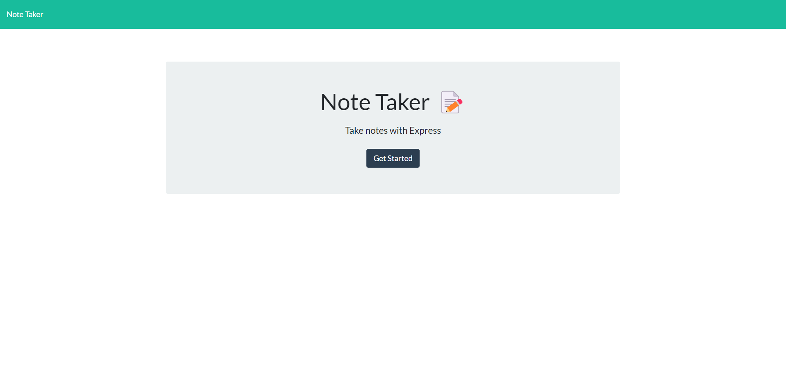

# Note Taker Challenge

## Description:
Note taker app that serves as a way to remember what you might forget later, why worry when note taker can help with this issue and allow the user to title and describe seperate notes which will be stored on a server. 

## Install:
1. Run "npm i" to install packages
2. Run "npm run start" to start the server on your terminal.
3. Use the browser to see the app in work on your local host
 

## Usage:

## Links:
[Github Repo](https://github.com/jon-dev092/note-taker-tool)
